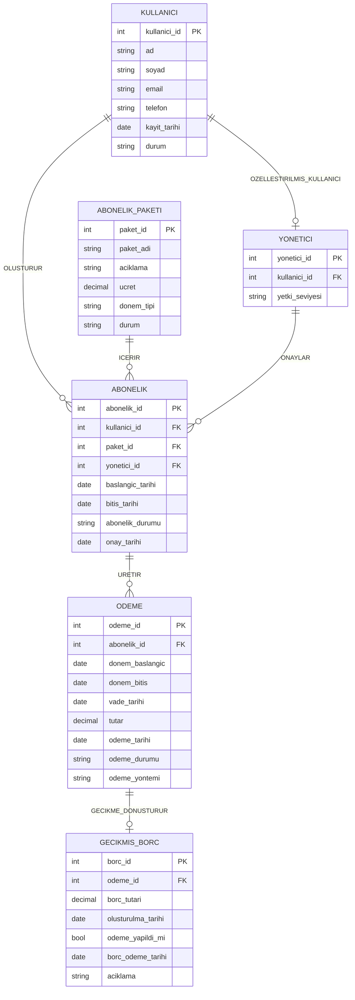

```mermaid
erDiagram
    KULLANICI {
        int kullanici_id PK
        string ad
        string soyad
        string email
        string telefon
        date kayit_tarihi
        string durum
    }

    YONETICI {
        int yonetici_id PK
        int kullanici_id FK
        string yetki_seviyesi
    }

    ABONELIK_PAKETI {
        int paket_id PK
        string paket_adi
        string aciklama
        decimal ucret
        string donem_tipi
        string durum
    }

    ABONELIK {
        int abonelik_id PK
        int kullanici_id FK
        int paket_id FK
        int yonetici_id FK
        date baslangic_tarihi
        date bitis_tarihi
        string abonelik_durumu
        date onay_tarihi
    }

    ODEME {
        int odeme_id PK
        int abonelik_id FK
        date donem_baslangic
        date donem_bitis
        date vade_tarihi
        decimal tutar
        date odeme_tarihi
        string odeme_durumu
        string odeme_yontemi
    }

    GECIKMIS_BORC {
        int borc_id PK
        int odeme_id FK
        decimal borc_tutari
        date olusturulma_tarihi
        bool odeme_yapildi_mi
        date borc_odeme_tarihi
        string aciklama
    }

    KULLANICI ||--o{ ABONELIK : "OLUSTURUR"
    ABONELIK_PAKETI ||--o{ ABONELIK : "ICERIR"
    YONETICI ||--o{ ABONELIK : "ONAYLAR"
    ABONELIK ||--o{ ODEME : "URETIR"
    ODEME ||--o| GECIKMIS_BORC : "GECIKME_DONUSTURUR"
    KULLANICI ||--o| YONETICI : "OZELLESTIRILMIS_KULLANICI"
```
